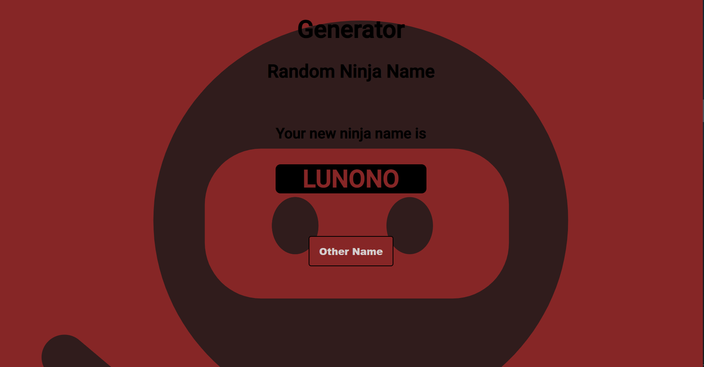

# <h1 align="center">Message Generator Program</h1>
<h2 align="center"><a href="https://necogamy.github.io/message_generator_program/">Here you can see the demo of this project</a></h2>

 

## **Overview**

## **Features**
* Every time a user runs the program, they should get a new, randomized output.
* This would be realized with random fragments of text and attached to be a final message.
* The randomized output would be a random ninja name.

## **Built with**
* JavaScript - ECMAScript-6
* CSS-3
* HTML-5
* Sass

## **Other tools used**
* Git
* GitHub
* Node

## **Researches for making the project or Acknowledge**
- [Random ninja names obtained from this meme that I used for making the project](https://www.risasinmas.com/wp-content/uploads/2012/03/crea-tu-nombre-ninja-rsm-600x553.jpg)

## **Contact**
- Website  - [Personal Portfolio](https://necogamy.github.io/Personal-Portfolio-Webpage/)
- GitHub   - [@necogamy](https://github.com/necogamy)
- LinkedIn - [Nicolás López](https://www.linkedin.com/in/nicogamy/)